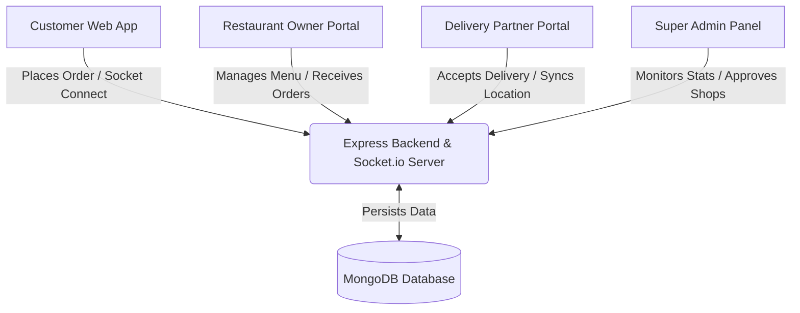

# 🍔 DigiEats - Premium Food Delivery Platform

DigiEats is a comprehensive, production-grade food delivery application built using the modern MERN stack (MongoDB, Express, React, Node.js). The platform is engineered with a modular, role-based architecture serving four distinct portals: a **Customer Web App**, a **Restaurant Owner Dashboard**, a **Delivery Partner Interface**, and a central **Super Admin Panel**.

With real-time order tracking, socket-based location sync, interactive maps, and highly secure role-based authorization, DigiEats offers a complete end-to-end food ordering and delivery ecosystem.

---

## 📐 System Architecture

The following diagram illustrates the workflow and data synchronization across the different modules:



---

## 🛠️ Technology Stack

| Layer | Technologies | Key Features |
|---|---|---|
| **Frontend Core** | React 19, Redux Toolkit, React Router DOM | High-performance state and SPA routing management |
| **Styling** | TailwindCSS, Lucide Icons | Responsive, mobile-first utility styling |
| **Backend Core** | Node.js, Express.js | Structured REST API architecture and server controllers |
| **Database** | MongoDB Atlas, Mongoose | Geospatial coordinates indexing (`2dsphere`) for proximity search |
| **Real-time Sync**| Socket.io | Full-duplex live updates for transit orders and agent locations |
| **Mapping** | Leaflet, OpenStreetMap, Nominatim API | Interactive mapping, geocoding, and routing |
| **Security** | JWT, HttpOnly Cookies, Firebase Auth | Secure token-based cookies and Google Single Sign-On (SSO) |

---

## 📦 Project Structure

```bash
DigiEats-web-app/
├── backend/        # Express REST API, MongoDB schemas, and controllers
├── frontend/       # React customer, owner, and delivery partner portals
└── admin-panel/    # React Super Admin panel UI
```

---

## ⚙️ Installation & Running Locally

### Prerequisites
- [Node.js](https://nodejs.org/) (v18 or higher recommended)
- MongoDB Connection URI (Local or Atlas)
- Internet connection (for geocoding and map tile fetching)

---

### Step 1: Configure Backend Environment

1. Navigate to the `backend/` directory:
   ```bash
   cd backend
   ```
2. Create a `.env` file in the backend root directory (refer to the sample keys below):
   ```ini
   PORT=8082
   MONGODB_URL=your_mongodb_connection_string
   JWT_SECRET=your_jwt_secret_key
   EMAIL=your_sender_email           # For transactional welcome emails
   PASS=your_email_app_password      # App password for email client
   CLOUDINARY_CLOUD_NAME=your_cloudinary_cloud_name
   CLOUDINARY_API_KEY=your_cloudinary_api_key
   CLOUDINARY_API_SECRET=your_cloudinary_api_secret
   RAZORPAY_KEY_ID=your_razorpay_key_id
   RAZORPAY_KEY_SECRET=your_razorpay_key_secret
   ```
3. Install backend dependencies and run the server:
   ```bash
   npm install
   npm run dev
   ```
   The backend server will run on **`http://localhost:8082`**.

---

### Step 2: Configure and Run Frontend (Customer / Owner / Delivery)

1. Navigate to the `frontend/` directory:
   ```bash
   cd frontend
   ```
2. Create a `.env` file in the frontend root:
   ```ini
   VITE_FIREBASE_APIKEY=your_firebase_api_key
   VITE_GEOAPIKEY=your_location_geocoding_api_key
   VITE_RAZORPAY_KEY_ID=your_razorpay_key_id
   ```
3. Install dependencies and launch the dev server:
   ```bash
   npm install
   npm run dev
   ```
   The web application will open at **`http://localhost:5173`**.

---

### Step 3: Run Admin Panel

1. Navigate to the `admin-panel/` directory:
   ```bash
   cd admin-panel
   ```
2. Install dependencies and launch the dev server:
   ```bash
   npm install
   npm run dev
   ```
   The admin panel will open at **`http://localhost:5174`** (or auto-select the next available port).

---

## 🧪 Seeding Default Accounts

To explore the application easily, you can seed/create test accounts or use the ones generated automatically:

1. **Super Admin**:
   - Run `node create-admin.js` in the `backend/` directory.
   - Credentials: **`your-email@gmail.com`** / **`your-admin-password`**
2. **Customer**:
   - Register via the frontend signup form or use: **`customer@digieats.com`** / **`password123`**
3. **Restaurant Owner**:
   - Register via the signup form selecting the "Owner" role or use: **`owner@digieats.com`** / **`password123`**
4. **Delivery Partner**:
   - Register via the signup form selecting the "Delivery" role or use: **`delivery@digieats.com`** / **`password123`**
