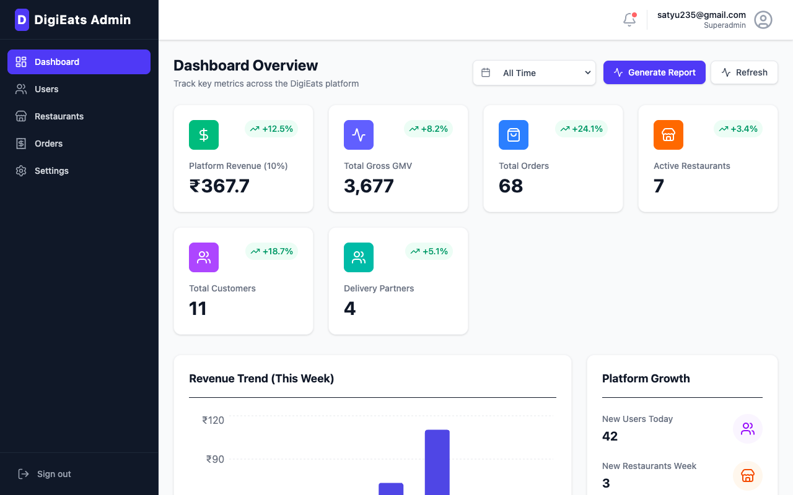
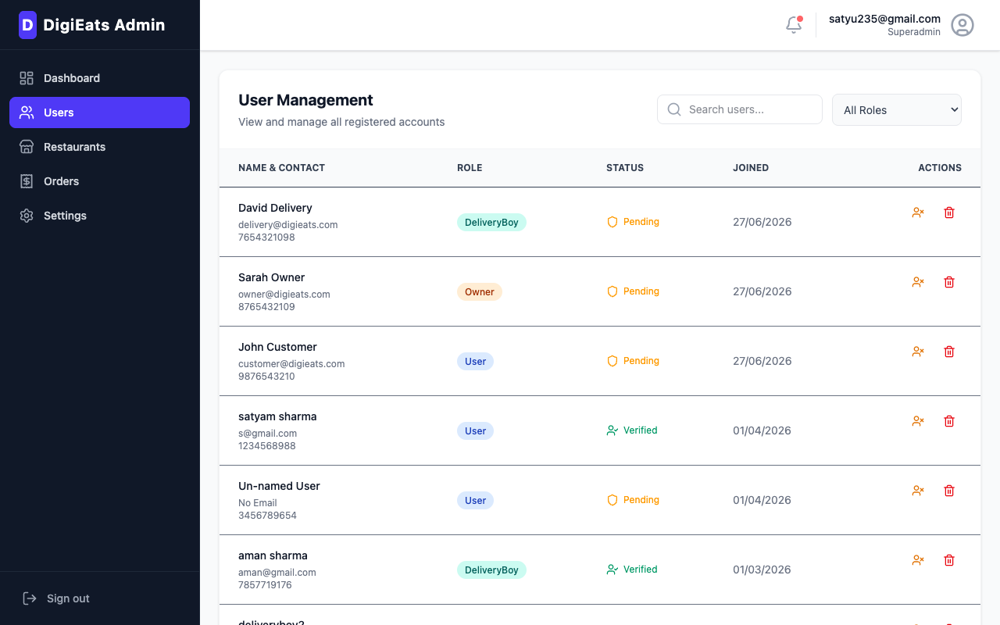
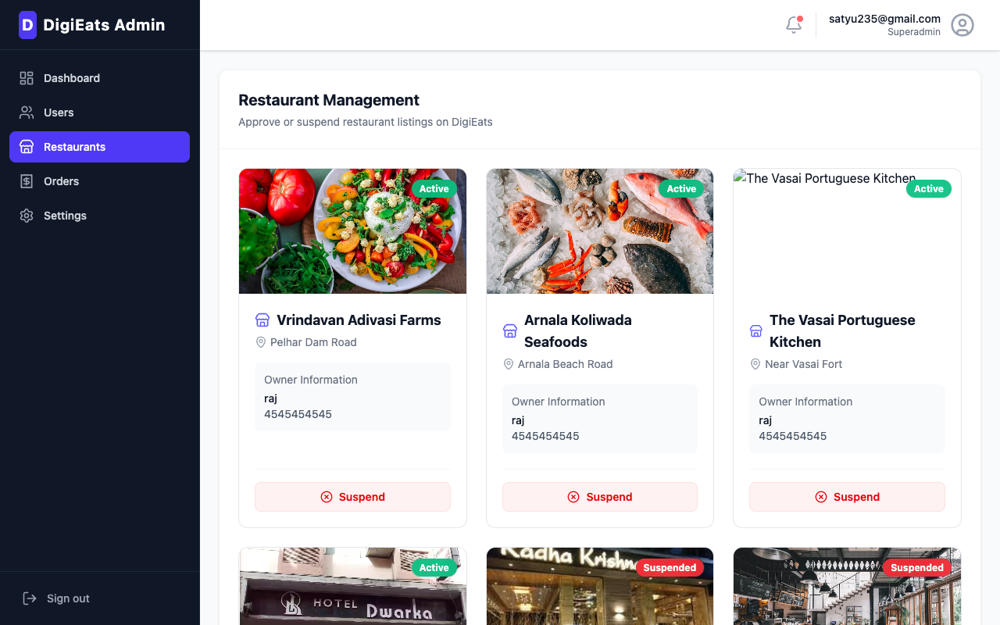
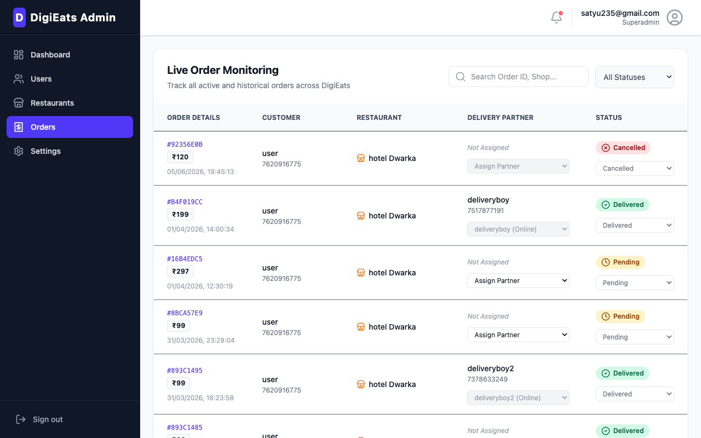
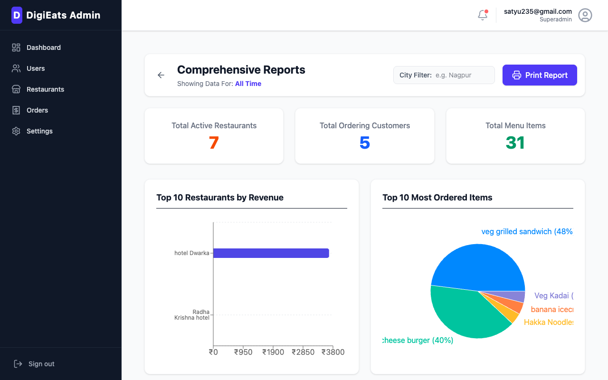
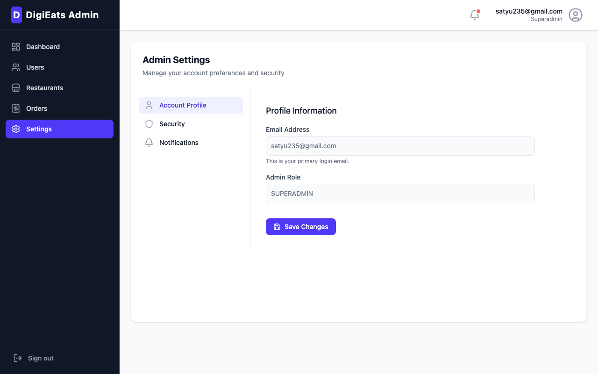
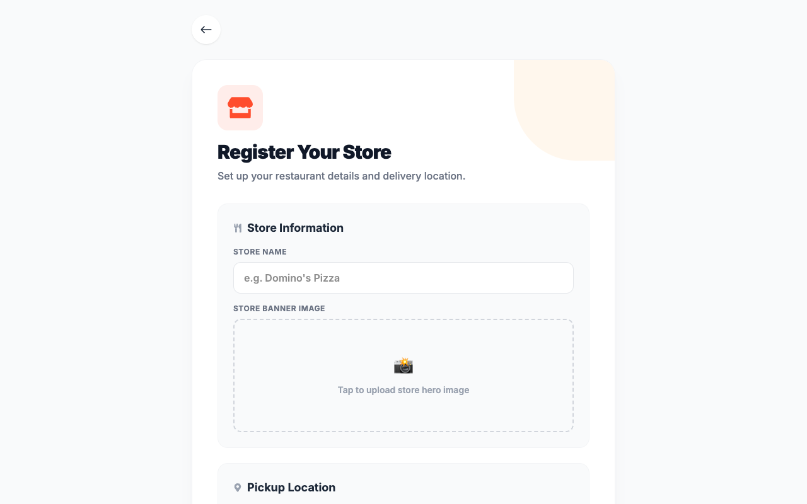
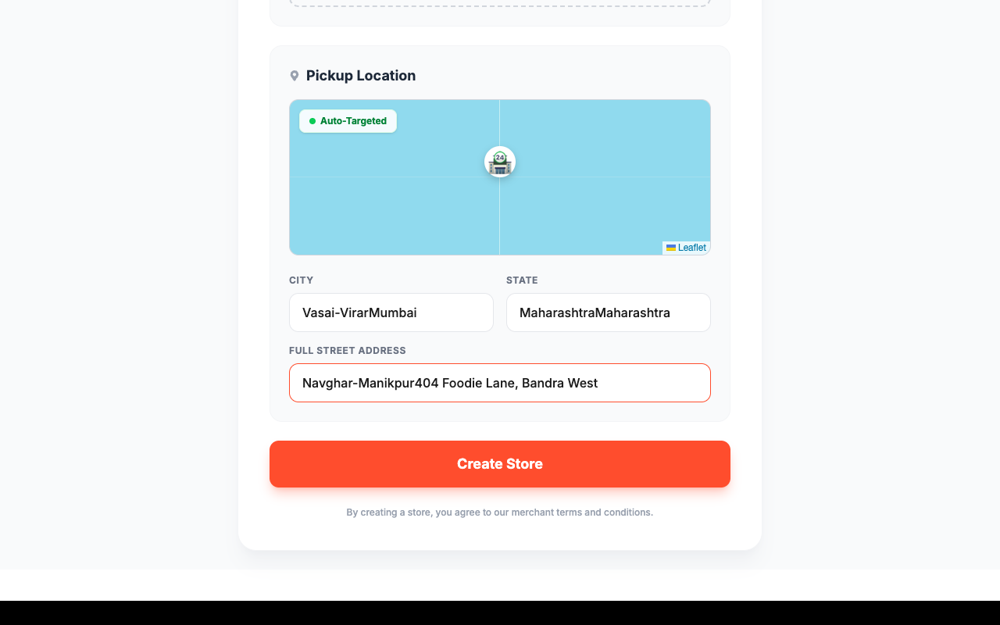
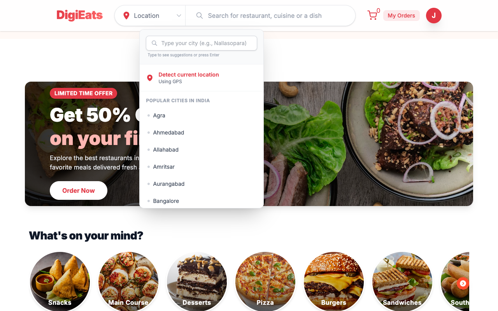
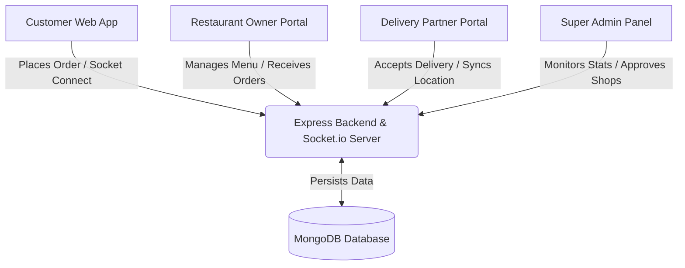

# 🍔 DigiEats - Premium Food Delivery Platform

🚀 **Live Demo**: [digieats-web.netlify.app](https://digieats-web.netlify.app)

DigiEats is a comprehensive, production-grade food delivery application built using the modern MERN stack (MongoDB, Express, React, Node.js). The platform is split into four specialized modules: a **Customer Web App**, a **Restaurant Owner Dashboard**, a **Delivery Partner Interface**, and a central **Super Admin Panel**.

With real-time order tracking, socket connections, interactive map integrations, and role-based permissions, DigiEats offers a seamless end-to-end food ordering and delivery ecosystem.

---

## 🚀 Key Modules & Visual Walkthrough

### 1. 👑 Super Admin Dashboard (`admin-panel`)
A centralized management console for platform admins to monitor system-wide statistics, manage registered restaurants and users, track all orders, and run business reports.
- **Admin Dashboard**: Real-time sales charts, orders count, and key KPIs.
- **User Management**: View and manage all platform users (customers, restaurant owners, delivery partners).
- **Restaurant Management**: Approve, reject, or suspend food store outlets.
- **Orders & Analytics**: Full traceability of active, pending, and completed orders.

#### Admin Screen Walkthrough
| Admin Dashboard | User Management |
|:---:|:---:|
|  |  |

| Shop Management | Order Analytics |
|:---:|:---:|
|  |  |

| Reports & Analytics | Settings |
|:---:|:---:|
|  |  |

---

### 2. 🏪 Restaurant Owner Portal
A premium interface designed for restaurant partners to register their shops, upload and manage their menus, and receive and prepare incoming orders in real-time.
- **Restaurant Onboarding**: Drag-and-drop Leaflet GPS maps to pin exact coordinate boundaries.
- **Dashboard & Stats**: Daily, weekly, and monthly earnings breakdown with interactive Recharts graphics.
- **Menu Manager**: Complete CRUD operations for food categories and items (add descriptions, prices, availability, and banners).

#### Owner Screen Walkthrough
| Onboarding / Registration | Add Menu Item |
|:---:|:---:|
|  |  |

| Empty Dashboard (CTA) | Active Store Dashboard |
|:---:|:---:|
|  |  |

---

### 3. 🍕 Customer Web App (`frontend`)
An elegant storefront for customers to browse nearby restaurants, search for food items, manage their cart, make payments, and track their delivery agents on interactive maps.
- **Home / Discover**: Custom restaurant listings sorted by proximity and categories.
- **Shop Detail**: Detailed restaurant page showcasing categories, menus, item availability, and custom cart additions.
- **Cart & Checkout**: Unified cart showing item counts, taxes, subtotal, and secure checkout.
- **Order History & Real-time Map Tracking**: Live order tracking via Socket.io mapping coordinates.

#### Customer Screen Walkthrough
| Discover Restaurants | Shopping Cart |
|:---:|:---:|
|  |  |

| Shop Details & Menu | Order History |
|:---:|:---:|
|  |  |

---

### 4. 🚴 Delivery Partner Portal
A specialized mobile-responsive dashboard for delivery agents to accept tasks, view pickup and drop-off navigation details, and update transit statuses.
- **Active Orders Queue**: View pending assignments in the vicinity.
- **Navigation & Tracking**: Live location sync and directions via OpenStreetMap/Leaflet markers.

#### Delivery Screen Walkthrough
| Delivery Dashboard |
|:---:|
|  |

---

## 📐 System Architecture

The following diagram illustrates the workflow and data synchronization across the different modules:



---

## 🛠️ Technology Stack

| Component | Technology | Description |
|---|---|---|
| **Frontend Core** | React 19, Redux Toolkit, React Router DOM | High-performance state & routing management |
| **Styling** | TailwindCSS, Lucide/React Icons | Utility-first responsive design framework |
| **Backend Core** | Node.js, Express.js | Robust RESTful API & Server Framework |
| **Database** | MongoDB Atlas, Mongoose | NoSQL Document Database with Geospatial Indexing |
| **Real-time Sync** | Socket.io | Full-duplex live order/location status updates |
| **Mapping & Location**| Leaflet, OpenStreetMap, Nominatim API | Interactive maps and reverse geocoding |
| **Authentication** | JWT, HttpOnly Cookies, Firebase Auth | Secure token-based and Google SSO logins |

---

## 📦 Project Structure

```bash
DigiEats-web-app/
├── backend/        # Express server, MongoDB models, routes, controllers
├── frontend/       # React customer/owner/delivery partner web application
└── admin-panel/    # React Super Admin panel UI
```

---

## ⚙️ Installation & Running Locally

### Prerequisites
- [Node.js](https://nodejs.org/) (v18 or higher recommended)
- MongoDB Connection URI (Local or Atlas)
- Internet connection (for remote database connections and map assets)

---

### Step 1: Configure Backend Environment

Navigate to the `backend/` directory:
```bash
cd backend
```

Create a `.env` file in the backend root directory (a sample `.env` with credentials is provided):
```ini
PORT=8082
MONGODB_URL=mongodb+srv://...     # Your MongoDB Connection URI
JWT_SECRET=YOUR_JWT_SECRET_KEY
EMAIL=YOUR_SENDER_EMAIL           # Used for transactional welcome emails
PASS=YOUR_EMAIL_APP_PASSWORD      # App Password for email client
CLOUDINARY_CLOUD_NAME=...         # Cloudinary cloud name for food image assets
CLOUDINARY_API_KEY=...            # Cloudinary API key
CLOUDINARY_API_SECRET=...         # Cloudinary API secret
RAZORPAY_KEY_ID=...               # Razorpay public key ID
RAZORPAY_KEY_SECRET=...           # Razorpay secret key
```

Install backend dependencies and run the server in development mode:
```bash
npm install
npm run dev
```
The backend server will spin up on **`http://localhost:8082`**.

---

### Step 2: Configure and Run Frontend (Customer / Owner / Delivery)

Navigate to the `frontend/` directory:
```bash
cd frontend
```

Create a `.env` file in the frontend root:
```ini
VITE_FIREBASE_APIKEY=YOUR_FIREBASE_API_KEY
VITE_GEOAPIKEY=YOUR_OPENWEATHER_OR_LOCATION_API_KEY
VITE_RAZORPAY_KEY_ID=YOUR_RAZORPAY_KEY_ID
```

Install frontend dependencies and launch the dev server:
```bash
npm install
npm run dev
```
The web app will open at **`http://localhost:5173`**.

---

### Step 3: Run Admin Panel

Navigate to the `admin-panel/` directory:
```bash
cd admin-panel
```

Install admin-panel dependencies and launch the dev server:
```bash
npm install
npm run dev
```
Since port `5173` is occupied by the frontend, the admin panel will automatically start at **`http://localhost:5174`** (or specify another port).

---

## 🧪 Seeding Default Accounts

To explore the application easily, you can seed/create test accounts or use the ones generated automatically:

1. **Super Admin**:
   - Run `node create-admin.js` in the `backend/` directory.
   - Credentials: **`your-email@gmail.com`** / **`your-admin-password`**
2. **Customer**:
   - Register via the frontend signup form or use: **`customer@digieats.com`** / **`password123`**
3. **Restaurant Owner**:
   - Register via the signup form selecting the "Owner" role or use: **`owner@digieats.com`** / **`password123`**
4. **Delivery Partner**:
   - Register via the signup form selecting the "Delivery" role or use: **`delivery@digieats.com`** / **`password123`**
