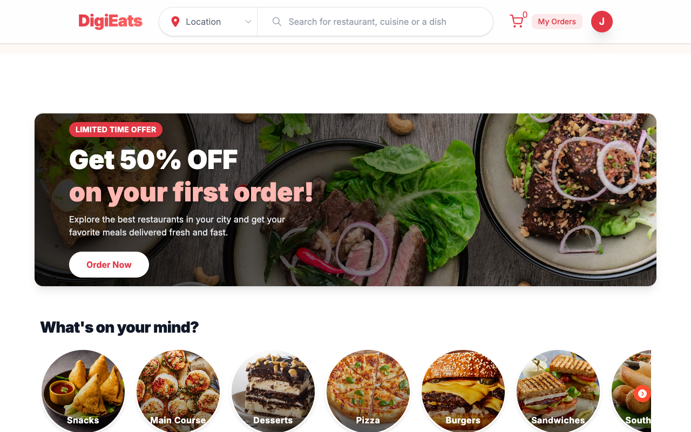
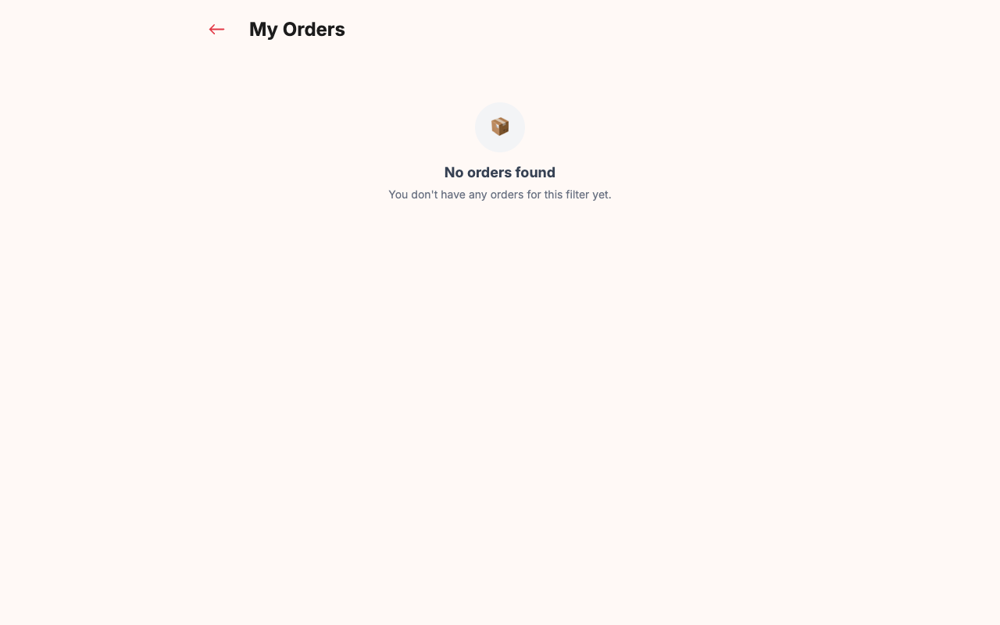
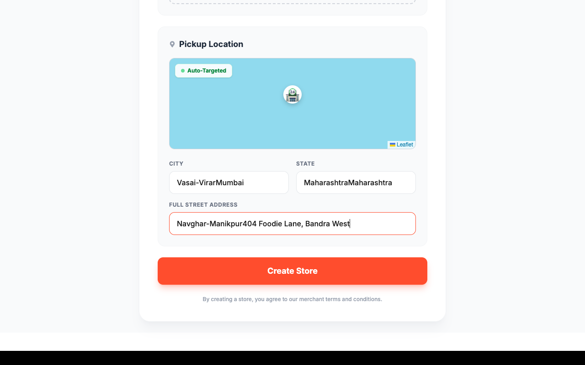
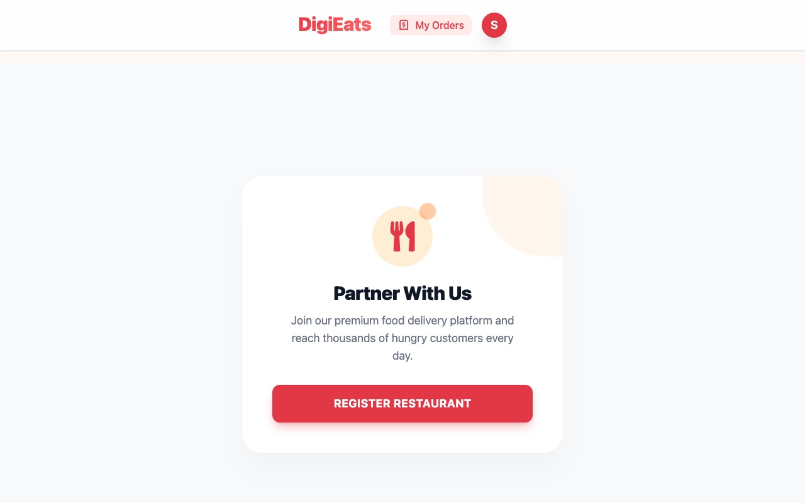
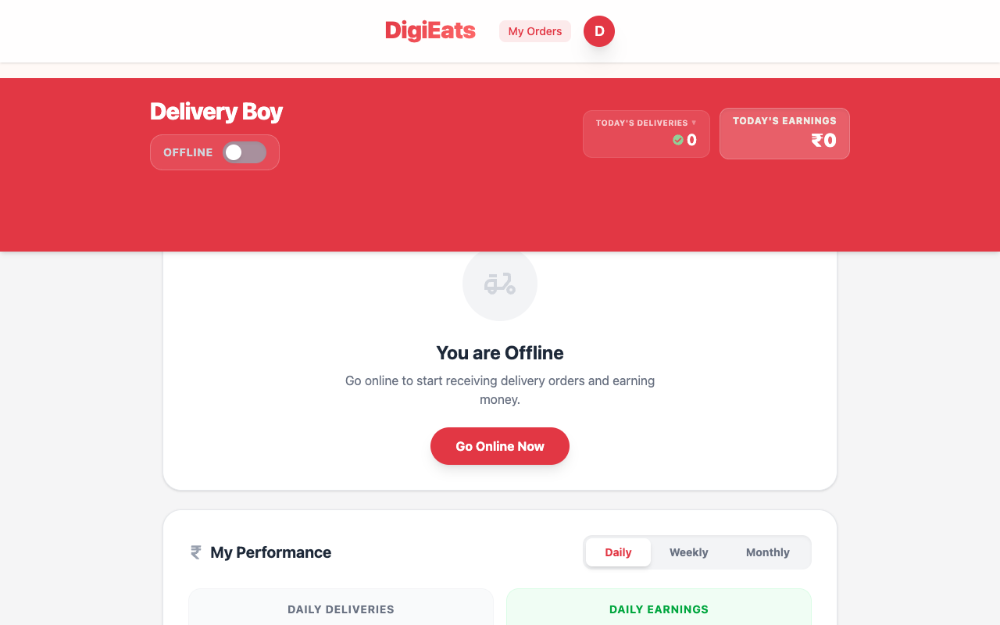

# 📱 DigiEats Frontend Web Application

This is the user-facing frontend for the DigiEats platform, built using React, Vite, Redux Toolkit, TailwindCSS, Socket.io, and Leaflet Maps. 

The frontend contains **three integrated portals** inside a single React application, resolved dynamically using the user's role:
1. 🍕 **Customer Portal** - For discovering restaurants, adding food to a cart, checking out via Razorpay, and tracking deliveries live.
2. 🏪 **Restaurant Owner Portal** - For managing restaurant info, setting physical geolocations via drag-and-drop maps, and managing the food menu.
3. 🚴 **Delivery Partner Portal** - For receiving assigned orders and updating order delivery statuses.

---

## 📸 Modules & Interface Screenshots

### 1. Customer Experience
| Store Discover (Proximity Based) | Menu Selection |
|:---:|:---:|
|  |  |

| Shopping Cart | My Orders (History) |
|:---:|:---:|
|  |  |

---

### 2. Restaurant Owner Experience
| Register Restaurant Form | Add Menu Item |
|:---:|:---:|
|  |  |

| Empty Dashboard (CTA) | Active Owner Dashboard |
|:---:|:---:|
|  |  |

---

### 3. Delivery Partner Experience
| Delivery Dashboard |
|:---:|
|  |

---

## 🛠️ Tech Stack & Libraries

- **Build Tool**: Vite (Ultra-fast HMR and bundling)
- **Framework**: React 19
- **State Management**: Redux Toolkit & React-Redux (maintains user state, cart state, active shop data, order logs)
- **Routing**: React Router DOM (Declarative client-side routing)
- **Styles**: TailwindCSS (Utility-first responsive styling)
- **Maps**: Leaflet & React Leaflet (pins delivery locations, handles reverse geocoding via Nominatim API)
- **Real-time Communication**: Socket.io-client (syncs live delivery partner coordinate positions and status updates)
- **Notification**: React Hot Toast (sleek, non-blocking toast notifications)

---

## 📁 Source Code Folder Structure

```bash
frontend/
├── public/                 # Static assets (favicons, food mock images)
├── src/
│   ├── assets/             # Images, banners, and logos
│   ├── components/         # Reusable widgets (Nav, Footer, Cards, Dashboards)
│   │   ├── UserDashboard.jsx
│   │   ├── OwnerDashboard.jsx
│   │   └── DeliveryBoy.jsx # Delivery Partner Dashboard
│   ├── hooks/              # Custom React hooks (location, fetching data)
│   ├── pages/              # Main routing views (Cart, Checkout, SignUp, SignIn, etc.)
│   ├── redux/              # Redux slices for auth, cart, owner contexts
│   ├── App.jsx             # Root layout and route declarations
│   ├── firebase.js         # Firebase OAuth configurations
│   └── main.jsx            # Application entry point
```

---

## ⚙️ Environment Variables Setup

Create a `.env` file in the root of the `frontend/` directory:

```ini
VITE_FIREBASE_APIKEY=YOUR_FIREBASE_API_KEY
VITE_GEOAPIKEY=YOUR_GEOAPI_KEY
VITE_RAZORPAY_KEY_ID=YOUR_RAZORPAY_KEY_ID
```

- **`VITE_FIREBASE_APIKEY`**: Used to initialize Firebase for Google Sign-In.
- **`VITE_GEOAPIKEY`**: Used for geolocation lookups and reverse geocoding.
- **`VITE_RAZORPAY_KEY_ID`**: Public Razorpay key used to instantiate the Razorpay checkout overlay.

---

## 🏃 Launch Instructions

1. **Install Dependencies**:
   ```bash
   npm install
   ```
2. **Start Development Server**:
   ```bash
   npm run dev
   ```
   The application will be accessible at **`http://localhost:5173`**.

3. **Production Build**:
   ```bash
   npm run build
   ```
   This generates an optimized production bundle inside the `dist/` directory.
